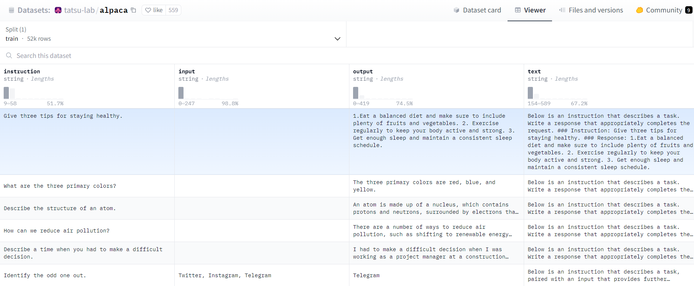

======================
Refinement with LUDWIG
======================

|colab|

..

Now, to be honest, we don't actually need to follow all these steps from scratch to fine-tune a model these days. We can use frameworks such as LUDWIG.

This section explains how to perform fine-tuning of a language model using Ludwig, a powerful tool that simplifies the machine learning lifecycle. The process involves using a specific model configuration and a dataset to adapt a pre-trained model to a specialized task.

Configuration
-------------

Before starting, ensure that Ludwig is installed and configured in your environment. You will also need to configure the Hugging Face Hub token to access pre-trained models. This is achieved by setting the environment variable HUGGING_FACE_HUB_TOKEN with your Hugging Face API key:

.. code-block:: bash

    pip install ludwig ludwig[llm] peft

.. code-block:: python

    import os
    os.environ["HUGGING_FACE_HUB_TOKEN"] = os.getenv('HUGGINGFACE_API_KEY')

Ludwig requires a YAML configuration that describes the model and training parameters. Key elements of this configuration include:

- model_type: Indicates the type of model. For language models, 'llm' is used.
- base_model: Specifies the pre-trained model to use. Several options can be provided, commented for easy change.
- quantization: Applies model quantization to reduce model size, with 'bits' specifying the quantization level.
- adapter: An adapter allows for efficient fine-tuning. The 'lora' adapter is used in this example.
- prompt: Defines the prompt template for input data.
- input_features and output_features: Describe the input and output data structures and preprocessing steps.
- trainer: Configures the training process, including learning rate, batch size, and epochs.

Here is an excerpt from the YAML configuration:

.. code-block:: yaml

    model_type: llm
    base_model: mistralai/Mistral-7B-v0.1
    quantization:
        bits: 4
    adapter:
        type: lora
    prompt:
        template: |
            ### Instruction:
            {instruction}
            ### Input:
            {input}
            ### Response:
    input_features:
        - name: prompt
          type: text
    output_features:
        - name: output
          type: text
    trainer:
        type: finetune

Dataset
-------

The dataset used in this example is Alpaca, a unique resource intended for training and fine-tuning language models to better follow **instructions**.

Alpaca includes 52,000 instructions and demonstrations generated by OpenAI's text-davinci-003 engine. This dataset is specifically designed for instructive fine-tuning of language models to improve their ability to follow instructions.

Training
--------

To train the model, load the configuration and specify the dataset. The LudwigModel class is used with the train method:

.. code-block:: python

    from ludwig.api import LudwigModel
    import yaml
    import logging

    config = yaml.safe_load(config_str)
    model = LudwigModel(config=config, logging_level=logging.INFO)
    results = model.train(dataset="ludwig://alpaca")

Saving the Model
----------------

After training, save the model for later use or deployment:

.. code:: python

    model.save("results")

You can also save it directly on the Hugging Face platform 🤗

.. code:: bash

    python -m ludwig.upload hf_hub --repo_id "Ensamien_001/mistralai-7B-v01-fine-tuned-using-ludwig-4bit" --model_path results/api_experiment_run_2

