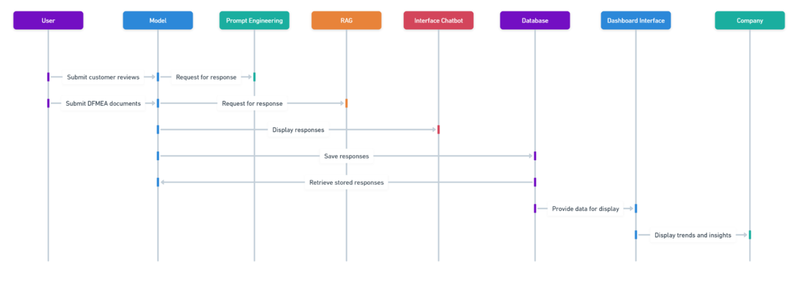
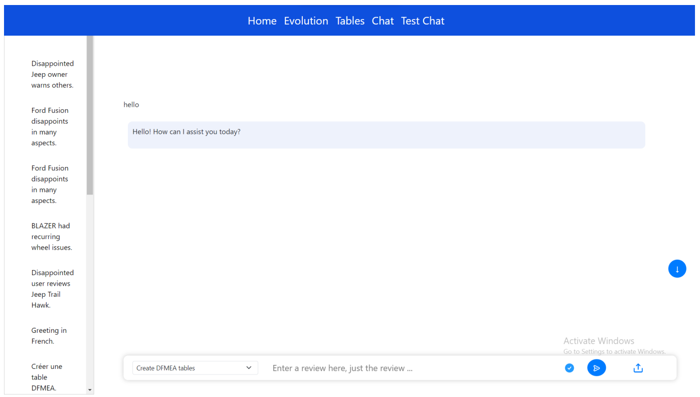
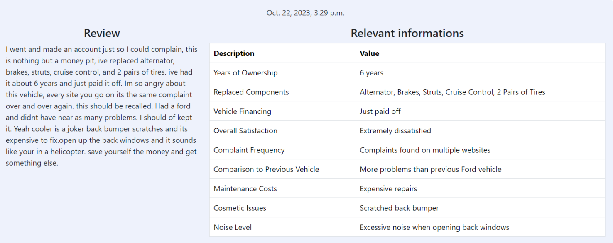
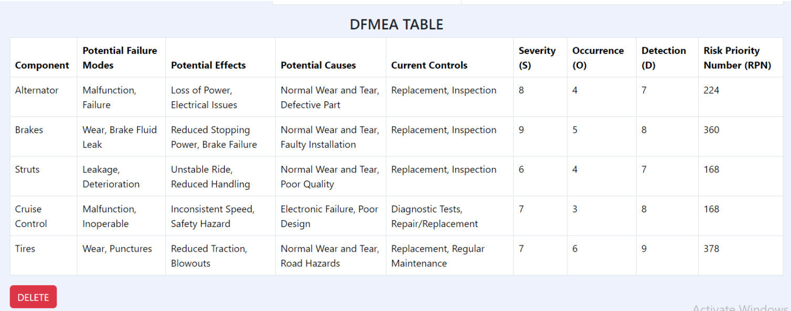
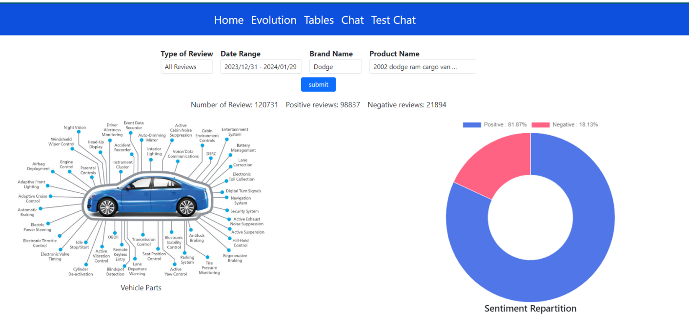
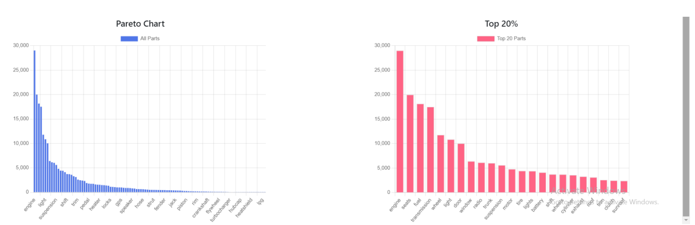
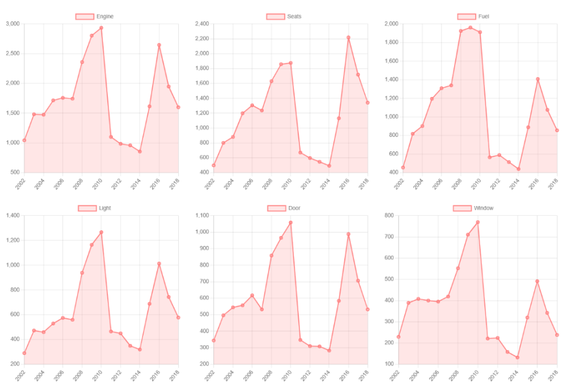

Platform 📱
=====================

Our ultimate goal is to develop an intuitive, operational, and secure platform.
In this section, we will detail the process of creating the platform and how it
functions.

The Tools Used
^^^^^^^^^^^^^^^^^

The Django Framework
-------------------

In the development of the platform, several tools were employed to ensure an
efficient and robust implementation. Among these tools, Django, a Python web
framework, was chosen as the fundamental base. Django offers an organized
structure, simplified database management, advanced security features, and
facilitates the rapid deployment of web applications.

The PostgreSQL Database
--------------------

The database, based on PostgreSQL, is specifically designed to store
information about vehicle parts and statistics related to their evolution.
PostgreSQL was chosen for its flexibility, robustness, and support for advanced
features, making it an ideal choice for storing and managing predictive data.

OpenAI API
--------------

The OpenAI API is an application programming interface (API) provided by
OpenAI, a company specializing in artificial intelligence. The OpenAI API
allows developers to integrate OpenAI's language models, such as GPT
(Generative Pre-trained Transformer), into their own applications, products, or
services.

LangChain
------------

LangChain is a framework designed to develop applications powered by language
models, facilitating their integration into various applications. It mainly
consists of schemas and models.

Platform Architecture
^^^^^^^^^^^^^^^^^^^

Our platform integrates a chat interface, a dashboard, and a database. Users
submit reviews about vehicles via the chat. The model, using prompt engineering
or RAG, generates comprehensive contextual responses (DFMEA Table, information
on elements in the database). These responses are displayed in the chatbot and
recorded in the database. The model can also use database data for personalized
responses. The information from the database is visualized on the dashboard,
helping the company make informed decisions based on observed trends.

The Chat Interface
----------------

The chat interface offers the functionality for users to generate the company's DFMEA (Design Failure Mode and Effect Analysis) reports via the RAG model. By interacting with this interface, users can ask questions or submit specific requests regarding aspects of vehicle design.

DFMEA Table Generation
---------------------------

When a user submits a review containing complaints about a vehicle, the chat interface activates using the RAG model. In the given context, the model is instructed to generate HTML code for a table of relevant information as well as a DFMEA (Design Failure Mode and Effect Analysis) table. The model, through prompt engineering, produces the necessary HTML code, explicitly excluding unauthorized tags and elements. It thus creates two distinct tables: a table of relevant information, including details such as the year of purchase, current mileage, major repairs, etc., and a detailed DFMEA table, categorizing vehicle components, potential failure modes, associated effects, probable causes, current controls, as well as severity, occurrence, detection measures, and risk priority numbers (RPN).

The chat interface, being an HTML interpreter, then displays these generated tables directly in the conversation. The result is a clear and concise presentation of relevant information and DFMEA analysis, ready to be interpreted and used by the user. This process ensures an accurate and immediate response to the specific requirements defined in the context.

Dashboard
----------

The Dashboard allows us to visualize trends in customer information in our database and make decisions accordingly. It is a summary of all user interactions with the chatbot. Key features of this dashboard include real-time analysis, continuous evaluation of improvement impacts, in-depth exploitation of reviews, and automatic updating of indicators.

Using the Pareto diagram, also known as the 80/20 rule, we simplify the analysis by identifying and prioritizing major problems or the most predominant causes contributing to defects, errors, or inefficiencies.

To delve deeper, we can also visualize the temporal evolution of each part. This process is updated in real-time with each new customer review issued. Below is an overview of the specific statistics for each part in our dashboard.

As illustrated in Figure 12, each individual part is represented based on the number of occurrences in customer reviews. This process is dynamic and can be adapted to specifically analyze negative, positive reviews, by month, by product, etc.
