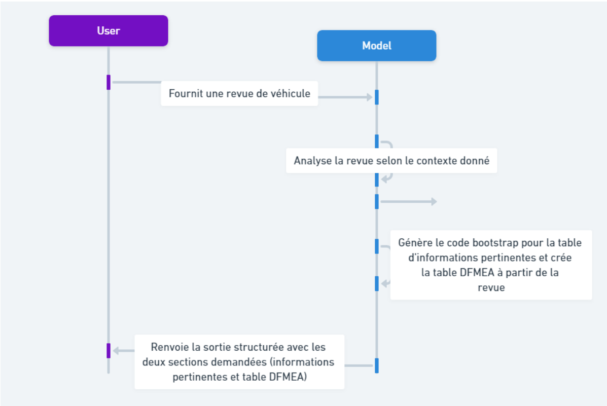

Prompt Engineering Approach 💭
------------------------

As part of our project, we need to find an effective prompt engineering
technique to generate our table based on user input. For this, we opted for the
one-shot approach, as our model, being already very efficient, did not need
many examples to understand the task at hand. Here is the structure of our
prompt: System: These are the instructions provided to the model regarding its
behavior and how it should perceive itself. Example: This is a prompt
completion illustration serving as a reference for the model when generating
its responses. It consists of two parts:

— UserContent: Example of user input.
— ModelResponse: An example of the ideal response the model is supposed to produce.

Completion: This is the model's response to the user's request, taking into
account not only its initial prompt but also the example prompt provided in the
context, as well as the instructions specified at the system level. The process
is summarized in this figure:

..
