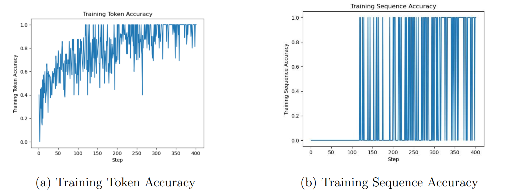

Fine-Tuning Approach 🔧
=====================

Data Collection 📊
^^^^^^^^^^^^^^^

To collect the data for training our models, we utilized the Kaggle platform [2024], which serves as an online database dedicated to Data Science projects. This platform provided us access to fifty distinct datasets concerning customer reviews of fifty different vehicle brands. All these datasets have a uniform structure with the same column names, including:
- **Review_Date**: The date the author published their review.
- **Author_Name**: The name of the author who wrote the review on the vehicle.
- **Vehicle_Title**: The title or name of the vehicle being reviewed.
- **Review_Title**: The title given by the author to their review, providing an overview of the content.
- **Review**: The detailed text of the review written by the author about the vehicle.
- **Rating**: The rating given by the author to evaluate the vehicle, usually on a scale (e.g., from 1 to 5 stars).
These columns contain crucial information about vehicle reviews, such as the publication date, author, vehicle concerned, review title, content, and the rating given.

Data Processing
^^^^^^^^^^^^^^^

Labeling
-------------

This phase of the project is crucial as it involves creating our target column ("Target") that will store the lists of vehicle parts. To do this, we performed web scraping on two websites: wikipedia.com [wik] and listexplained.com [lis]. These sites provided us access to a non-exhaustive list of vehicle parts, totaling about seven hundred references. We are aware that our list does not cover all vehicle parts and does not account for all possible names for the same part. However, for now, we will stick to this and improve our list as we progress.
To conclude this labeling phase, we went through our entire dataset, creating two new columns:
- "List_part": which contains a list of vehicle parts found in each review.
- "Count_part": which indicates the number of parts present in each review.
At this stage, we can affirm that our dataset is on the right track and we are ready to move on to the fine-tuning stage.

Preparing the Dataset for Fine-Tuning
---------------------------

Once we have determined that fine-tuning is the appropriate solution,
indicating that our prompt has been optimized to the best of its abilities and
persistent issues with the model have been identified, it is imperative to
prepare the data for model training. In this crucial step, we must create a
varied set of demonstration conversations, similar to the conversations we will
ask the model to respond to during inference in production. Each example in our
dataset must be a conversation structured in the same format as our chat
completion API, including a list of messages where each message has a role,
content, and possibly a name. It is essential to include in these training
examples situations where the requested model does not behave as desired. The
messages provided as an assistant in the data must represent the ideal
responses we want the model to provide. This approach ensures that the model is
trained on diverse and specific examples, including cases where improvements
are needed. This allows guiding the model towards the ideal responses we expect
in various situations during the use of the model in production. The final step
is to format our dataset; for this, we have added an end sequence to all
prompts: it ends with the character string "->" which indicates to the model
that it can start completing, i.e., generating the list of parts; and an end
sequence, all completions end with the word "END" to indicate to the model that
it must stop, we do this to prevent the model from continuing to generate
unwanted words. And now we convert our dataset into a Jsonl file which will be
the format used for fine-tuning.

Model Training
^^^^^^^^^^^^^^^^^^

After meticulously preparing and formatting our data, we begin the training phase, crucial for creating the model. To do this, we use the OpenAI command line tool (CLI), executing a series of commands. Our data is then uploaded, accompanied by the hyperparameters we have defined, and the training process is initiated.
In our approach, we have chosen an iterative training process that allows for continuous model adjustment, constantly refining its performance. This iterative fine-tuning methodology involves multiple cycles of model improvement, contrasting with a single iteration of fine-tuning. We gradually adapt our model, perfecting its performance over iterations.
The main objective of this project is to train a versatile model capable of performing various detection tasks, including recognizing part names, identifying part-related issues or defects, and understanding context. Initially, our efforts focus exclusively on detecting part names, and then we will gradually integrate the other objectives over time.

.. image:: ../images/itterative.png
    :width: 90%
    :align: center
    :alt: itterative

Model Evaluation
^^^^^^^^^^^^^^^^

Our first model, partfinder_t_001, was trained on 1000 lines of our dataset, representing 5.56% of the total. Following the training, the model's performance is accessible in a results.csv file. This file contains a line for each training step, where a step refers to a forward and backward pass on a batch of data.
- elapsed_tokens: the number of tokens the model has processed so far (including repetitions)
- elapsed_examples: the number of examples the model has processed so far (including repetitions), an example corresponding to an element of the batch. For example, with batch_size = 4, each step will increase elapsed_examples by 4.
- training_loss: the loss on the training batch
- training_sequence_accuracy: the percentage of completions in the training batch for which the tokens predicted by the model exactly match the actual completion tokens.
- training_token_accuracy: the percentage of tokens in the training batch that were correctly predicted by the model.
The evolution of our model's performance at each stage of its training is presented in the figures below.

..

