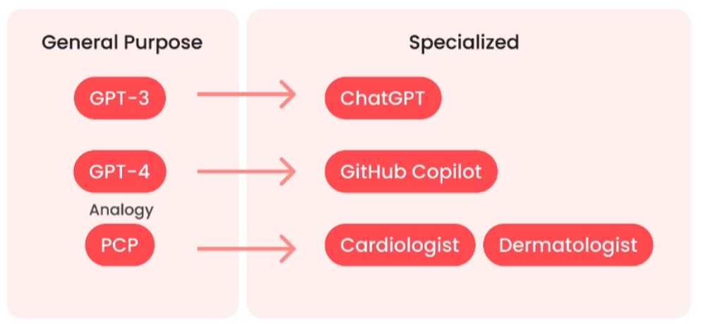
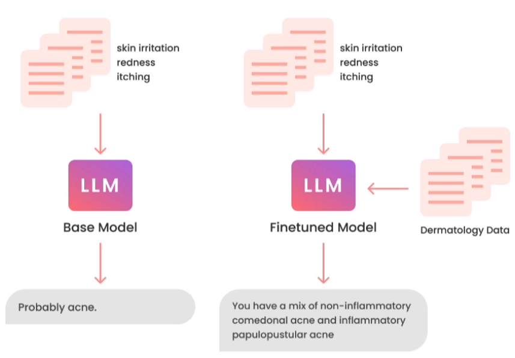
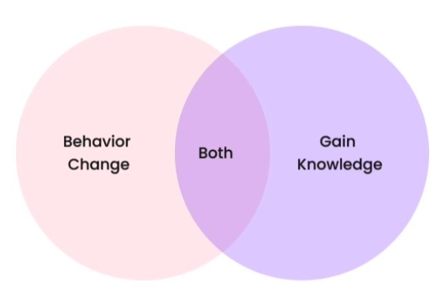
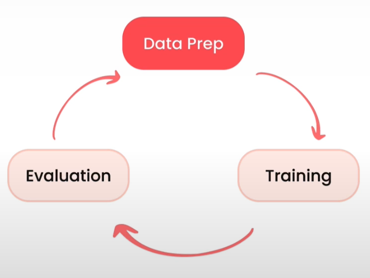

Understanding Fine-Tuning: Theory and Concepts 📖
====================================

What is fine-tuning?
-------------------------
Fine-tuning is an iterative process aimed at improving a model's performance on
a specific task while preserving the knowledge previously acquired during
initial training. This approach relies on the model's ability to generalize to
new domains while maintaining its ability to specialize. By adjusting the
weights of the connections between neurons, fine-tuning allows the model to
adapt to the new task without significantly altering pre-existing knowledge.

Take, for example, a standard natural language model. While it can answer your
specific questions about a certain domain, the response is generally vague.
However, if we fine-tune it on data specific to this domain, the response will
be transformed to be more precise and detailed.

The advantages of fine-tuning
------------------------------

- Performance:
   - Stop hallucinations
   - Increase coherence
   - Reduce unwanted information

- Privacy:
   - On-site or VPC (Virtual Private Cloud)
   - Prevent leaks
   - No violations

- Cost:
   - Reduce cost per request
   - Increase transparency
   - Greater control

- Reliability:
   - Control availability
   - Reduce latency
   - Moderation

What does fine-tuning do for you?
-------------------------

- Behavior change:
   - Learn to respond more consistently
   - Learn to focus, for example on moderation
   - Detect capabilities, for example being better in conversation or generating DFMEA tables in our case

- Knowledge acquisition
   - Increase knowledge of new specific concepts
   - Have knowledge more or less limited to the company in our case
   - Correct old incorrect information

Tasks for fine-tuning a language model
--------------------------

- Text only input, text output:
   - Extraction: Text input, less text output
      - "Reading"
      - Keywords, topics, routing, agents (planning, reasoning, self-criticism, tool use), etc.
   - Expansion: Text input, more text output
      - "Writing"
      - Chat, writing emails, writing code

- Task clarity is a key indicator of success
- Clarity means knowing what is bad, good, and better

.. note::
   The fine-tuning process is generally an iterative process.

