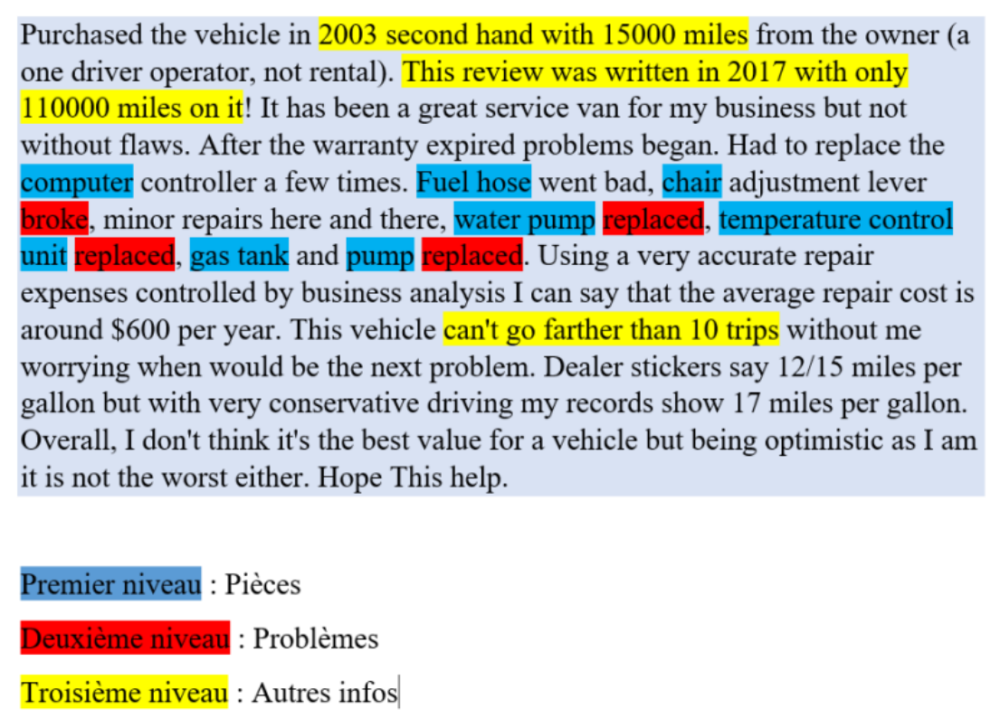

Methodology
--------------

Our methodology is based on two different approaches: the first approach is
fine-tuning and the second approach is prompt engineering. As shown in Figure
1, our project targets three levels, namely: detection of part names, issues
related to these parts, and also crucial information that will allow us to
understand the general context of the problem. But for now, we will focus on
creating a model capable of detecting part names in customer reviews, and
subsequently, we can look for an approach to accomplish the other tasks. For
this, we have decided to use an approach based on Fine-tuning Transformer
models, notably the GPT-3 model. The advantage of this kind of approach is that
the base models are already so performant that they can quickly yield good
results with little data, but the disadvantage is that they are costly.

..

.. toctree::
    :maxdepth: 2

    Fine-tuningApproach
    PromptEngineeringApproach

