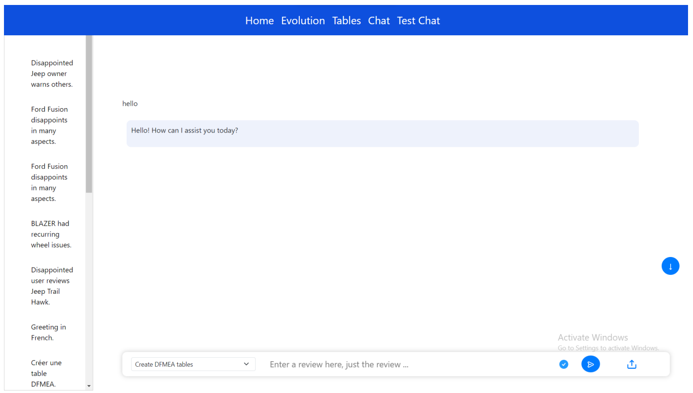
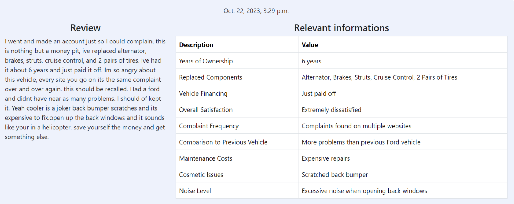
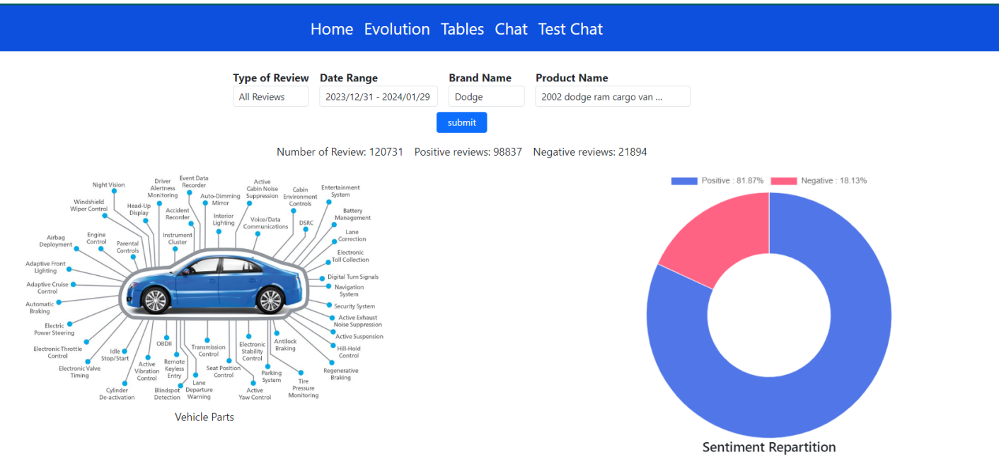
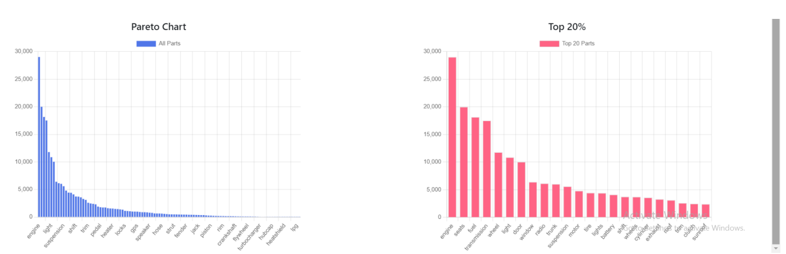
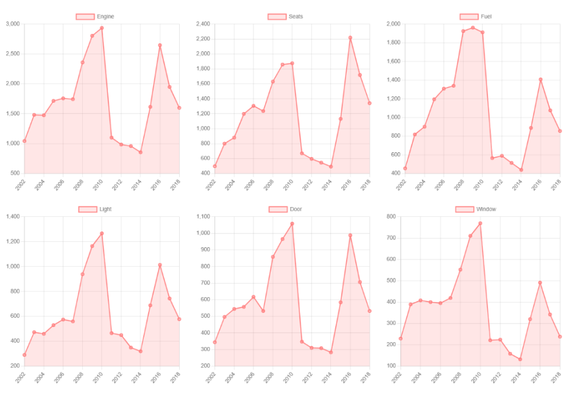

Plateforme 📱
=====================

Notre objectif final étant de développer une plateforme intuitive, opérationnelle
et sécurisée, dans cette section, nous allons détailler le processus de la création de
la plateforme et son fonctionnement.

Les Outils Utilisés
^^^^^^^^^^^^^^^^^

Le Framework Django
-------------------

Dans le cadre du développement de la plateforme, plusieurs outils ont été employés pour assurer une implémentation efficace et robuste. Parmi ces outils, Django,
un framework web en Python, a été choisi comme base fondamentale. Django offre
une structure organisée, une gestion simplifiée des bases de données, des fonctionnalités de sécurité avancées, et facilite le déploiement rapide d’applications web.

La base de données Postgresql
--------------------

La base de données, basée sur PostgreSQL, est spécifiquement conçue pour stocker les informations sur les pièces de véhicules , ainsi que les statistiques liées à leur
évolution. PostgreSQL a été choisi en raison de sa flexibilité, de sa robustesse, et de
sa prise en charge de fonctionnalités avancées, ce qui en fait un choix idéal pour le
stockage et la gestion des données prédictives.

OpenAI Api
--------------

L’API OpenAI est une interface de programmation d’application (API) fournie
par OpenAI, une entreprise spécialisée dans l’intelligence artificielle. L’API OpenAI
donne aux développeurs la possibilité d’intégrer les modèles de langage d’OpenAI,
tels que GPT (Generative Pre-trained Transformer), dans leurs propres applications,
produits ou services.

LangChain
------------

LangChain est un framework conçu pour développer des applications alimentées
par des modèles de langage, en facilitant leur intégration dans diverses applications.
Il se compose principalement de schémas et de modèles.

Architecture de la plateforme
^^^^^^^^^^^^^^^^^^^

Notre plateforme intègre une interface de chat, un tableau de bord et une base
de données. Les utilisateurs soumettent des avis sur les véhicules via le chat. Le
modèle, utilisant le prompt engineering ou le RAG, génère de complètes réponses
contextuelles ( Table DFMEA, informations sur les éléments dans la base de données).
Ces réponses sont affichées dans le chatbot et enregistrées dans la base de données.
Le modèle peut également utiliser les données de la base pour des réponses personnalisées. Les informations de la base sont visualisées sur le dashboard, aidant
l’entreprise à prendre des décisions éclairées basées sur les tendances observées.

.. image:: ../images/architecture.png
    :width: 100%
    :align: center
    :alt: Architecture de la plateforme

L’interface Chat
----------------

L’interface de chat offre la fonctionnalité permettant aux utilisateurs de générer
des rapports DFMEA (Design Failure Mode and Effect Analysis) de l’entreprise via
le modèle RAG. En interagissant avec cette interface, les utilisateurs peuvent poser
des questions ou soumettre des requêtes spécifiques concernant les aspects de la
conception des véhicules.

Génération des tables DFMEA
---------------------------

Lorsqu’un utilisateur soumet un avis contenant des plaintes sur un véhicule, l’interface de chat entre en action en utilisant le modèle RAG. Dans le contexte donné, le
modèle est instruit de générer du code HTML pour une table d’informations pertinentes ainsi qu’une table DFMEA (Design Failure Mode and Effect Analysis).
Le modèle, grâce au prompt engineering, produit le code HTML nécessaire, excluant explicitement les balises et éléments non autorisés. Il crée ainsi deux tables
distinctes : une table d’informations pertinentes, comprenant des détails tels que
l’année d’achat, le kilométrage actuel, les réparations majeures, etc., et une table
DFMEA détaillée, catégorisant les composants du véhicule, les modes potentiels de
défaillance, les effets associés, les causes probables, les contrôles actuels, ainsi que des
mesures de gravité, d’occurrence, de détection et de nombre de priorités de risque
(RPN).

L’interface de chat, étant un interpréteur HTML, affiche ensuite ces tables générées directement dans la conversation. Le résultat est une présentation claire et
concise des informations pertinentes et de l’analyse DFMEA, prête à être interprétée
et utilisée par l’utilisateur. Ce processus garantit une réponse précise et immédiate
en réponse aux exigences spécifiques définies dans le contexte.

.. image:: ../images/chat2.png
    :width: 90%
    :align: center
    :alt: chat interface

Dashboard
----------

Le Dashboard nous permet de visualiser les tendances des informations clients
dans notre base de données et de prendre des décisions en conséquence. C’est un
résumé de toutes les interactions des utilisateurs avec le chatbot.
Les fonctionnalités clés de ce tableau de bord incluent une analyse en temps réel,
l’évaluation continue de l’impact des améliorations, une exploitation approfondie des
avis et la mise à jour automatique des indicateur.

Utilisant le diagramme de Pareto, également appelé la règle des 80/20, nous simplifions l’analyse en identifiant et hiérarchisant les problèmes majeurs ou causes les
plus prédominantes contribuant aux défauts, erreurs ou inefficacités.

Pour approfondir davantage, nous pouvons également visualiser l’évolution temporelle de chaque pièce. Ce processus est actualisé en temps réel à chaque nouvel
avis client émis. Ci-dessous, un aperçu des statistiques spécifiques à chaque pièce
dans notre tableau de bord.

Comme illustré sur la Figure 12, chaque pièce individuelle est représentée en
fonction du nombre d’occurrences dans les avis clients. Ce processus est dynamique
et peut être adapté pour analyser spécifiquement les avis négatifs, positifs, par mois,
par produit, etc.
