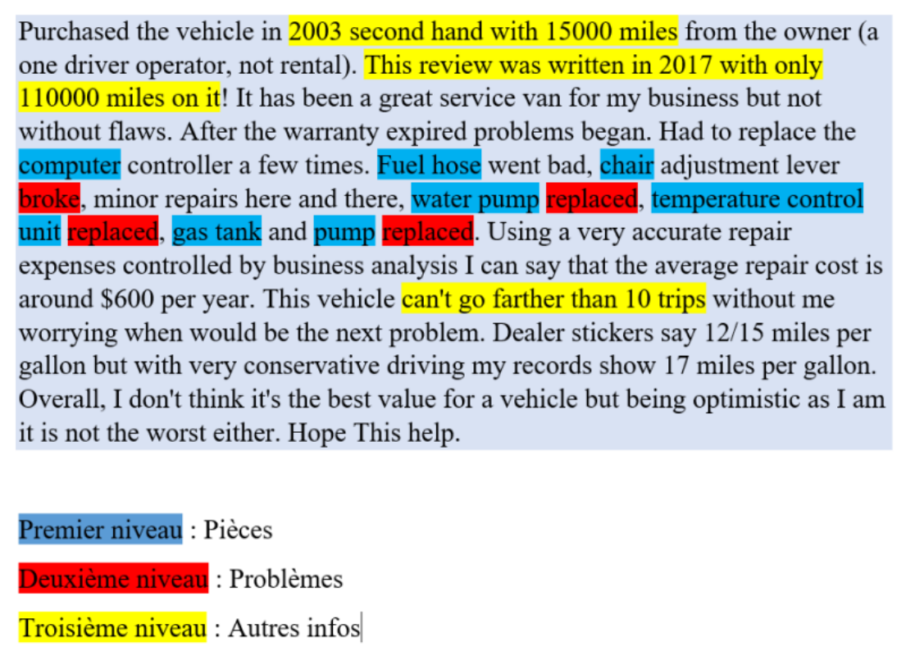

Méthodologie
--------------

Notre méthodologie se base sur deux approches différentes : la première approche
est le fine-tuning et la seconde approche est le prompt ingéniering.
Comme le montre la Figure 1, notre projet vise les trois niveaux, à savoir :
détection des noms de pièces, des problèmes liés à ces pièces et aussi les informations
cruciales qui nous permettrons de comprendre le contexte général du problème. Mais
pour le moment, nous allons nous concentrer sur la création d’un modèle capable de
détecter les noms de pièces dans les avis clients et par la suite, nous pouvons chercher
une approche pour réaliser les autres tâches. Pour cela, nous avons décidé d’utiliser
une approche basée sur le Fine-tuning des modèles Transformers, notamment le
modèle GPT-3 L’avantage de ce genre d’approche est que les modèles de base sont
déjà si performants qu’ils peuvent vite donner de bons résultats sur peu de données
mais l’inconvénient est qu’ils sont coûteux.

..

.. toctree::
    :maxdepth: 2

    Approchefine-tuning
    Approcheprompt-ing