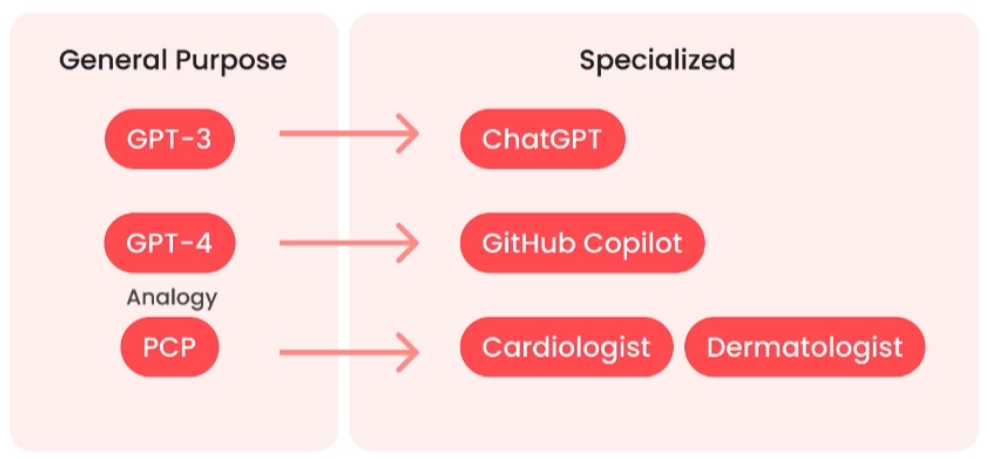
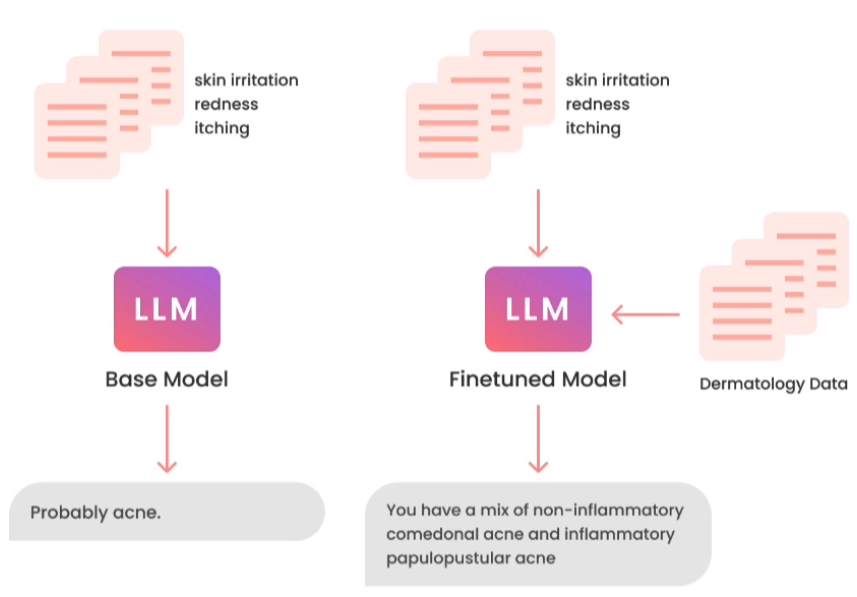

Compréhension de l'Affinage : Théorie et Concepts
====================================

C'est quoi d'abord le finetuning?
-------------------------
Le fine-tuning est un processus itératif visant à améliorer la performance d'un modèle sur une tâche spécifique tout en préservant
 les connaissances préalablement acquises lors de l'entraînement initial. Cette approche repose sur la capacité du modèle à généraliser 
 à de nouveaux domaines tout en conservant sa capacité à se spécialiser. En ajustant les poids des connexions entre les neurones,
le fine-tuning permet d'adapter le modèle à la nouvelle tâche sans altérer de manière significative les connaissances pré-existantes.

Prenons par exemple un modèle de langage naturel standard. Bien qu'il puisse répondre à vos questions spécifiques concernant un certain domaine, la réponse reste généralement vague. En revanche, si nous le finetunons sur des données spécifiques à ce domaine, la réponse sera transformée de manière à être plus précise et détaillée.

Les avantages du fine-tuning
------------------------------

- Performance:
   - Arrêter les hallucinations
   - Augmenter la cohérence
   - Réduire les informations indésirables

- Confidentialité:   
   - Sur site ou VPC (Virtual Private Cloud)
   - Empêcher les fuites
   - Aucune violation

- Coût:  
   - Réduire le coût par requête
   - Accroître la transparence
   - Plus grand contrôle

- Fiabilité:   
   - Contrôler la disponibilité
   - Réduire la latence
   - Modération

Que fait le finetuning pour vous?
-------------------------

- Changement de comportement:
   - Apprendre à répondre de manière plus cohérente
   - Apprendre à se concentrer, par exemple sur la modération
   - Détecter les capacités, par exemple être meilleur en conversation ou la géneration des tables DFMEA dans notre cas

- Acquisition de connaissances
   - Augmenter la connaissance de nouveaux concepts spécifiques
   - Avoir une connaissance plus ou moins limité a l'entreprise dans notre cas
   - Corriger les anciennes informations incorrectes

.. image:: ../images/finetuning_03.png
    :width: 50%
    :align: center
    :alt: Finetuning

Tâches pour affiner un modèle de langage
--------------------------

- Texte uniquement en entrée, texte en sortie :
   - Extraction : Texte en entrée, moins de texte en sortie
      - "Lecture"
      - Mots clés, sujets, routage, agents (planification, raisonnement, autocritique, utilisation d'outils), etc.
   - Expansion : Texte en entrée, plus de texte en sortie
      - "Écriture"
      - Chat, écrire des e-mails, écrire du code
      
- La clarté de la tâche est un indicateur clé du succès
- Clarté signifie savoir ce qui est mauvais, bon et meilleur

.. note:: 
   de plus le process de finetunning est géneralement un process itteratif.

.. figure:: ../images/itteratif.png
   :width: 100%
   :align: center
   :alt: finetuning
