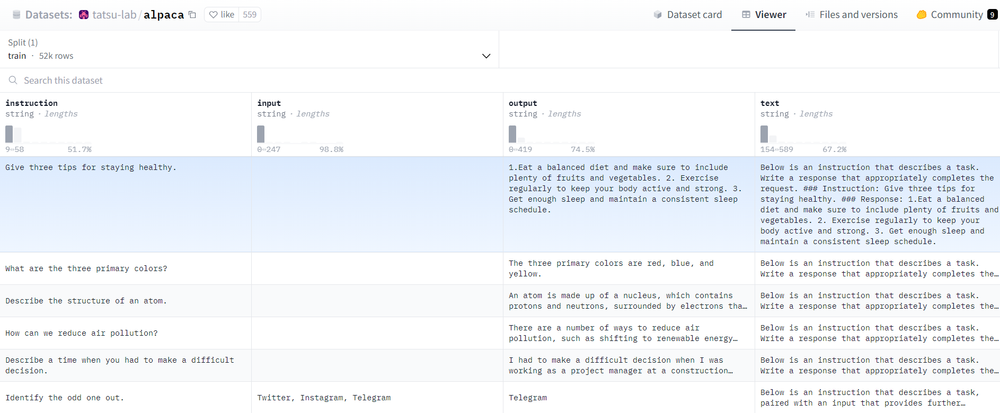

======================
Affinage par LUDWIG
======================

|colab|

.. |colab| image:: ../images/opencolab.png
    :width: 100
    :height: 20
    :target: https://colab.research.google.com/github/MasrourTawfik/DFMEA-LLM-Enhanced/blob/main/Documentation/colabs/affinage_par_ludwig_notebook_final.ipynb\
..

Maintenant, pour être honnête, nous n'avons pas réellement besoin de suivre toutes ces étapes à partir de zéro pour affiner un modèle de nos jours. Nous pouvons utiliser des frameworks tels que LUDWIG.

Cette section explique comment effectuer le fine-tuning d'un modèle de langage en utilisant Ludwig, un outil puissant qui simplifie le cycle de vie de l'apprentissage automatique. Le processus implique l'utilisation d'une configuration de modèle spécifique et d'un ensemble de données pour adapter un modèle pré-entraîné à une tâche spécialisée.

Configuration
-------------

Avant de commencer, assurez-vous que Ludwig est installé et configuré dans votre environnement. Vous devrez également configurer le token du Hugging Face Hub pour accéder aux modèles pré-entraînés. Ceci est réalisé en définissant la variable d'environnement HUGGING_FACE_HUB_TOKEN avec votre clé API Hugging Face :

.. code-block:: bash

    pip install ludwig ludwig[llm] peft

.. code-block:: python

    import os
    os.environ["HUGGING_FACE_HUB_TOKEN"] = os.getenv('HUGGINGFACE_API_KEY')

Ludwig nécessite une configuration YAML qui décrit les paramètres du modèle et de l'entraînement. Les éléments clés de cette configuration incluent :

- model_type : Indique le type de modèle. Pour les modèles de langage, 'llm' est utilisé.
- base_model : Spécifie le modèle pré-entraîné à utiliser. Plusieurs options peuvent être fournies, commentées pour un changement facile.
- quantization : Applique la quantification du modèle pour réduire la taille du modèle, avec 'bits' spécifiant le niveau de quantification.
- adapter : Un adaptateur permet un fine-tuning efficace. L'adaptateur 'lora' est utilisé dans cet exemple.
- prompt : Définit le modèle de prompt pour les données d'entrée.
- input_features et output_features : Décrivent les structures de données d'entrée et de sortie et les étapes de prétraitement.
- trainer : Configure le processus d'entraînement, y compris le taux d'apprentissage, la taille du lot et les époques.

Voici un extrait de la configuration YAML :

.. code-block:: yaml

    model_type: llm
    base_model: mistralai/Mistral-7B-v0.1
    quantization:
        bits: 4
    adapter:
        type: lora
    prompt:
        template: |
            ### Instruction :
            {instruction}
            ### Entrée :
            {input}
            ### Réponse :
    input_features:
        - name: prompt
          type: text
    output_features:
        - name: output
          type: text
    trainer:
        type: finetune

Dataset
-------

Le dataset qu'on a utilisé dans cet exemple c'est Alpaca, c'est une ressource unique destinée à l'entraînement et au fine-tuning des modèles de langue pour mieux suivre **les instructions**.

Alpaca comprend 52 000 instructions et démonstrations générées par l'engine text-davinci-003 d'OpenAI. Ce dataset est spécialement conçu pour le fine-tuning instructif des modèles de langue, afin d'améliorer leur capacité à suivre des instructions.

Entraînement
------------

Pour entraîner le modèle, chargez la configuration et spécifiez l'ensemble de données. La classe LudwigModel est utilisée avec la méthode train :

.. code-block:: python    

    from ludwig.api import LudwigModel
    import yaml
    import logging

    config = yaml.safe_load(config_str)
    model = LudwigModel(config=config, logging_level=logging.INFO)
    results = model.train(dataset="ludwig://alpaca")

Sauvegarde du Modèle
--------------------

Après l'entraînement, sauvegardez le modèle pour une utilisation ou un déploiement ultérieurs :

.. code:: python

    model.save("results")

Vous pouvez ainsi le sauvegarder directement sur la plateforme huggingface 🤗

.. code:: bash
    
    python -m ludwig.upload hf_hub --repo_id "Ensamien_001/mistralai-7B-v01-fine-tuned-using-ludwig-4bit" --model_path results/api_experiment_run_2

